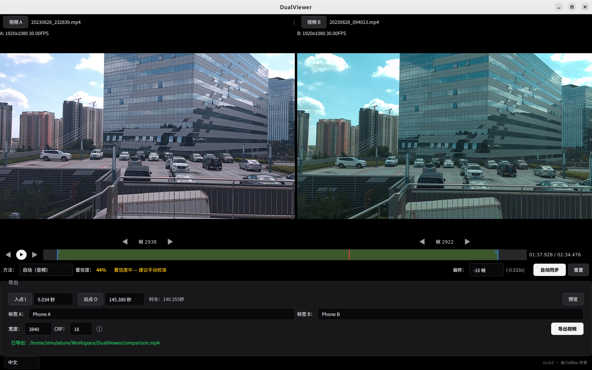
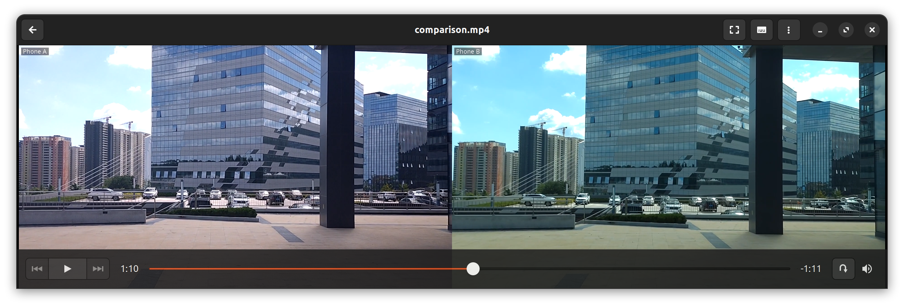

# DualViewer

[English](./README.md) | [中文](./README_ZH.md) | 日本語

デュアルビデオ並列比較ツール — **自動同期 → 並列プレビュー → 結合エクスポート**。

**English / 中文 / 日本語** の3言語UIに対応し、システム言語を自動検出します。



### エクスポート結果



---

## 機能

### 同期アライメント
- **音声自動同期** — FFT相互相関で2つのビデオの時間オフセットを計算、SNR信頼度スコア付き
- **手動微調整** — フレーム単位 / ±10フレームのオフセット調整、一時停止中にリアルタイムプレビュー
- **独立ステッピング** — 各ビデオを個別にフレーム送りして目視でアライメント

### 並列プレビュー
- デュアルビデオ等高再生、500ms間隔で自動ドリフト補正
- 各ビデオの現在フレーム番号をリアルタイム表示
- タイムライン上でクリックシーク、スムーズドラッグ対応

### 結合エクスポート
- FFmpeg hstackで並列結合（デフォルト幅 = 両ソース幅の合計）
- カスタムウォーターマーク（Pillowレンダリング、CJK対応）
- カスタムトリム範囲（In / Outポイント）、範囲プレビュー付き
- バックグラウンドスレッドでエクスポート + プログレスバー
- CRF品質制御（デフォルト18、視覚的ロスレス）

### 多言語
- **English**、**中文**、**日本語** に対応
- システム言語を自動検出、実行時に切り替え可能

### インターフェース
- ビデオ比較に最適化されたダークテーマ
- タイムライン可視化：オーバーラップ領域、トリム範囲、再生ヘッド
- 全操作をカバーするキーボードショートカット

---

## キーボードショートカット

| キー | 機能 |
|------|------|
| `Space` | 再生 / 一時停止 |
| `←` `→` | 両ビデオ同期 ±1フレーム |
| `[` `]` | オフセット ±1フレーム |
| `{` `}` | オフセット ±10フレーム |
| `I` | エクスポート開始点を設定 |
| `O` | エクスポート終了点を設定 |
| `Q` `E` | ビデオ A ±1フレーム |
| `A` `D` | ビデオ B ±1フレーム |

---

## クイックスタート

### ソースから実行

```bash
git clone https://github.com/simulatune/DualViewer.git
cd DualViewer

# 依存関係をインストール
pip install -r requirements.txt

# ffmpegがPATHにあることを確認
# Ubuntu: sudo apt install ffmpeg
# Windows: https://www.gyan.dev/ffmpeg/builds/

# 起動
python main.py
```

### ビルド済みバイナリをダウンロード

[Releases](https://github.com/simulatune/DualViewer/releases) から対応プラットフォームのファイルをダウンロード：

| プラットフォーム | ファイル |
|-----------------|---------|
| Linux x64 | `DualViewer` |
| Windows x64 | `DualViewer.exe` |

> ビルド済みバージョンにはFFmpegとCJKフォントが同梱されています。追加インストールは不要です。

---

## 使い方

1. **ビデオをインポート** — 「ビデオ A」「ビデオ B」をクリックして2つのビデオファイルを選択
2. **同期アライメント** — 「自動同期」をクリックして自動アライメント、または「手動」に切り替えて `[` `]` で微調整
3. **プレビュー** — スペースで再生、矢印キーでフレーム単位の比較
4. **範囲設定** — `I` で開始点、`O` で終了点を設定、「プレビュー」をクリックして確認
5. **エクスポート** — ウォーターマークテキストを入力、品質を設定、「ビデオをエクスポート」をクリック
6. **言語切り替え** — 左下のドロップダウンメニューから選択

---

## 技術スタック

| コンポーネント | 技術 |
|---------------|------|
| 言語 | Python 3.11+ |
| GUI | PySide6 (Qt6) |
| ビデオ処理 | FFmpeg / FFprobe (subprocess) |
| 音声分析 | NumPy + SciPy (FFT相互相関) |
| ウォーターマーク | Pillow |
| パッケージング | PyInstaller |
| CI/CD | GitHub Actions (Linux + Windows) |

---

## ビルド

```bash
pip install -r requirements.txt

# FFmpegを準備（resources/ に配置）
# Linux:
curl -L -o ffmpeg.tar.xz https://johnvansickle.com/ffmpeg/releases/ffmpeg-release-amd64-static.tar.xz
tar xf ffmpeg.tar.xz
cp ffmpeg-*-static/ffmpeg resources/ffmpeg
cp ffmpeg-*-static/ffprobe resources/ffprobe

# Windows:
# https://www.gyan.dev/ffmpeg/builds/ からダウンロードし、ffmpeg.exe / ffprobe.exe を resources/ に配置

# ビルド
python build.py

# 出力: dist/DualViewer (または DualViewer.exe)
```

---

## License

MIT
